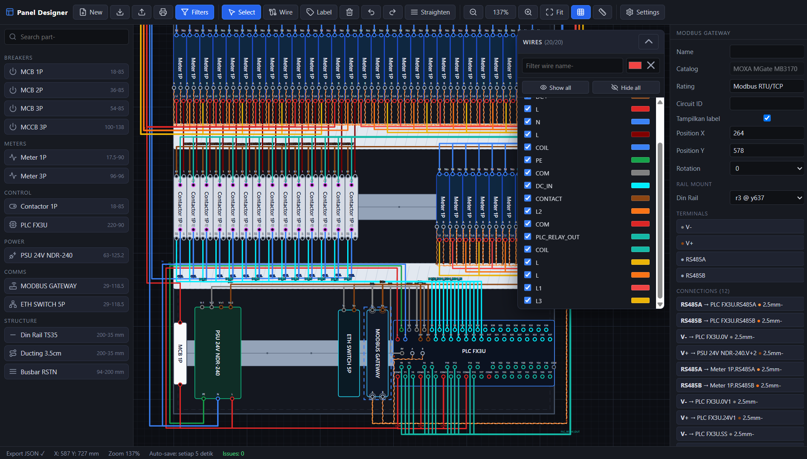

# Panel Designer ⚡

> Desain panel listrik secara visual - taruh komponen di atas din rail, rangkai kabelnya, dan langsung dapat validasi kelistrikan.

Untuk merancang panel distribusi & kontrol: MCB, meter, kontaktor, PLC, PSU hingga gateway MODBUS - lengkap dengan busy bar, ducting, dan wiring otomatis yang rapi.

## Badges


## Demo



[▶ Watch demo video](docs/demo.mp4)

[](https://muhammad-yunus.github.io/PanelDesigner)

## Fitur Utama

- **Library komponen drag & drop** - MCB 1P/2P/3P, MCCB, meter IEM2050/IEM3255, kontaktor CHINT NCH8, PLC FX3U-64MR, PSU MEANWELL NDR-240-24, gateway MODBUS Moxa MGate MB3170, switch ethernet 5 port, din rail & ducting.
- **Busy bar** L1 / L2 / L3 / N / PE dengan tap terminal yang menerima kabel.
- **Wiring orthogonal** - klik-terminal ke terminal, rute otomatis tegak/lurus; kabel RS485 dirender sebagai *twisted pair* A/B.
- **Geser komponen setelah diwiring** - kabel ikut menyesuaikan (memendek) secara langsung, baik di mode Select maupun Wire.
- **Auto-Straighten** - satu klik meluruskan semua kabel yang tidak tegak/lurus.
- **Routing manual** - seret segmen tengah kabel untuk mengubah jalur.
- **Validasi kelistrikan real-time** - deteksi salah sambung fasa, netral, PE, DC+, dan coil; ditampilkan di panel *Issues*.
- **Auto-save ke localStorage** + **Export/Import JSON**.
- **Print / Export PDF** - cetak layout panel langsung dari browser (pas satu halaman, orientasi mengikuti rasio panel).
- **Dialog selamat datang** - pilih *Simple BAS*, *Complete BAS* (520×720 mm) atau *Empty Panel*.
- **Undo / Redo**, zoom, grid, dan panel properti yang terintegrasi.

---

### Mulai Cepat

Buka [Panel Designer](https://muhammad-yunus.github.io/PanelDesigner) - tidak perlu instalasi apa pun.

Atau jalankan secara lokal:

```powershell
cd PanelMaker
python -m http.server 8000
# buka http://localhost:8000
```

## Struktur

```
panel-designer.html              # seluruh aplikasi (satu file)
example_panel_bas.json           # contoh Simple BAS
example_panel_bas_completed.json # contoh Complete BAS (520x720)
example_panel_empty.json         # contoh Empty Panel (tanpa komponen)
tools/regen_embed.js             # regenerasi embed contoh di HTML
docs/demo.mp4                # video demo (tampil di README)
index.html                       # redirect untuk GitHub Pages
```

> Ketiga contoh juga di-embed di `panel-designer.html` (`EXAMPLE_BAS` /
> `EXAMPLE_BAS_COMPLETED` / `EXAMPLE_EMPTY`) agar tetap jalan offline.
> Setiap file JSON contoh diubah, jalankan `node tools/regen_embed.js`.

## Tech Stack

- **HTML/CSS/JavaScript** murni - tanpa framework, tanpa step build.
- **SVG** untuk render kanvas (grid, komponen, terminal, kabel).
- **localStorage** untuk auto-save desain.